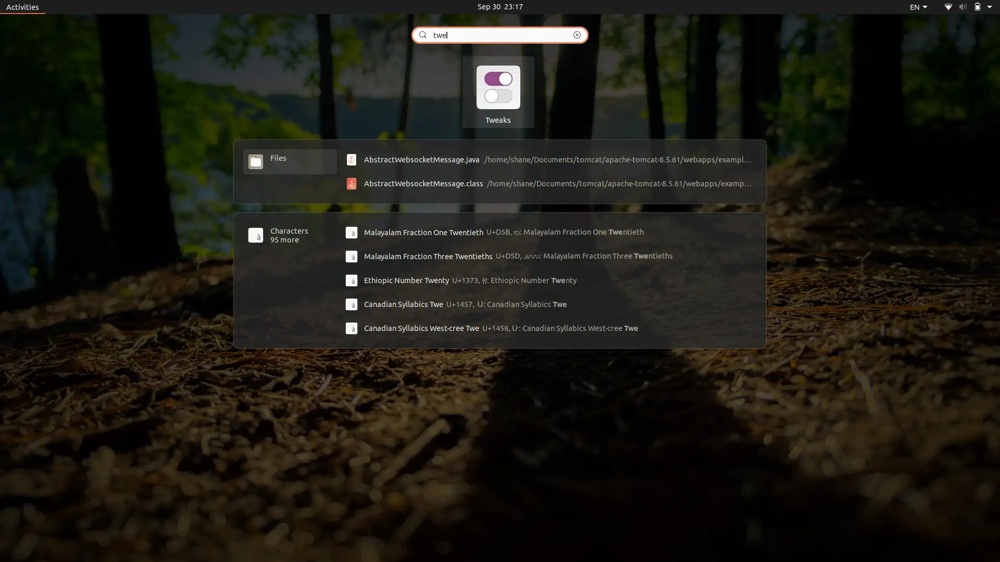
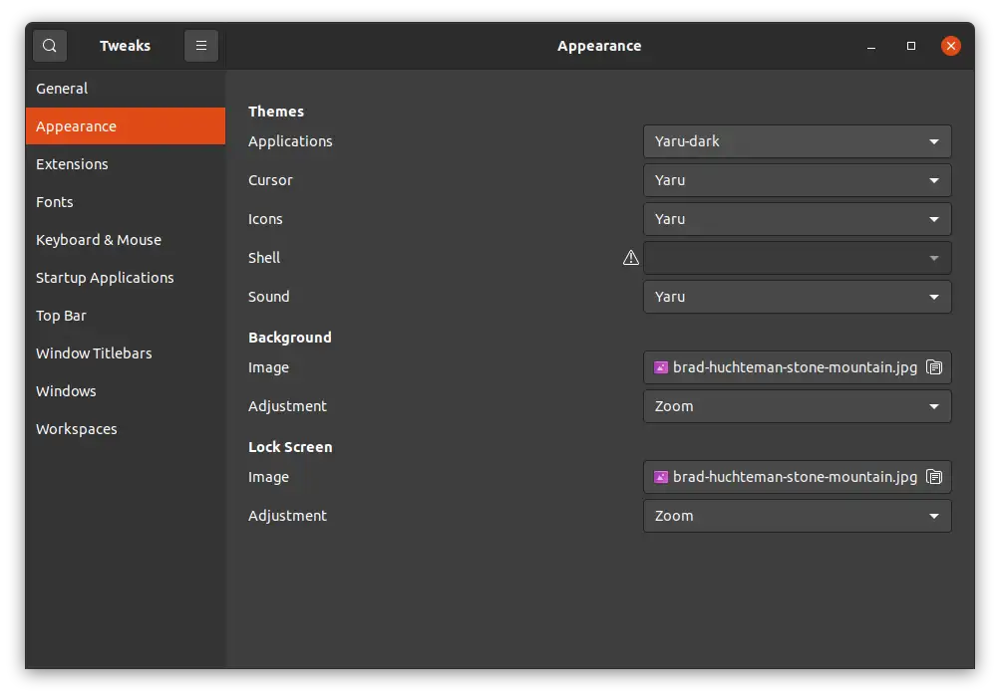
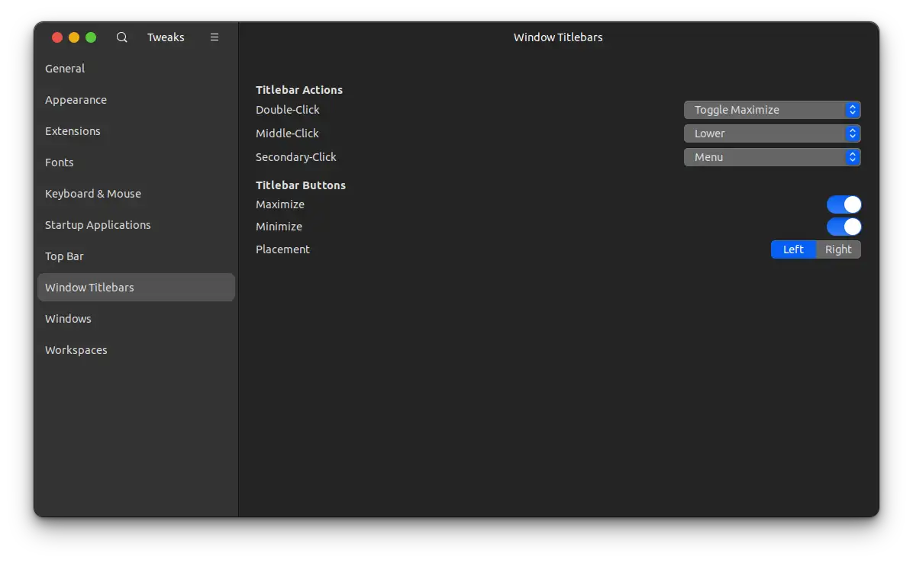

기본 Ubuntu 테마도 이쁘다. 보랏빛 테마의 배경화면에 왼쪽의 Dock 화면을 이용해보면 Windows의 기본 테마에 비해 확실히 트렌디하고 애니메이션이 맘에 든다.

프로그래밍을 하다보면 Windows, Mac OS, Linux 세 운영체제를 번갈아 사용하는 경우가 많은데, 어느정도 일관성 있는 인터페이스가 프로그래밍에 도움이 되지 않을까? 해서 가장 이뻐보이는 MacOS Theme을 적용시켜보기로 했다.

[WhiteSur Gtk Theme](https://www.gnome-look.org/p/1403328) 을 클릭해 Gnome-look.org 사이트에 올라가있는 WhiteSur Gtk Theme 테마 페이지로 이동한다.


옆의 보라색 Download 버튼을 눌러서 파일을 받아준다. 나는 WhiteSur-gtk-theme을 이용해 테마를 적용할 것이다.


.WhiteSur-gtk-theme을 누를경우 github 페이지로 이동한다.


옆의 Code > Download Zip파일을 눌러 Zip파일을 받아준 후, 우분투의 다운로드 폴더에서 Zip파일을 압축 해제 시켜준다.

그 이후 압축 해제한 폴더를 ~/.themes 에 넣어준다.

```linux
mkdir ~/.themes
mv ~/다운로드/WhiteSur폴더이름/.themes/
```

테마를 옮겨주었다면, 이제 테마를 적용해 줄 차례다

```linux
$ sudo apt update
$ sudo apt install gnome-tweaks
```

sudo apt 명령어를 이용해 gnome-tweaks 를 받아주자.



그 이후 tweaks 혹은 '기능 개선'을 검색해 해당 어플리케이션으로 이동



Tweaks>Appearance 탭의 Applications 에서 WhiteSur 테마를 적용시키면 된다.



Windows Titlebars 에서 Placement를 Left로 바꿔주면 정말 MacOS에 있는 듯한 느낌이 난다.